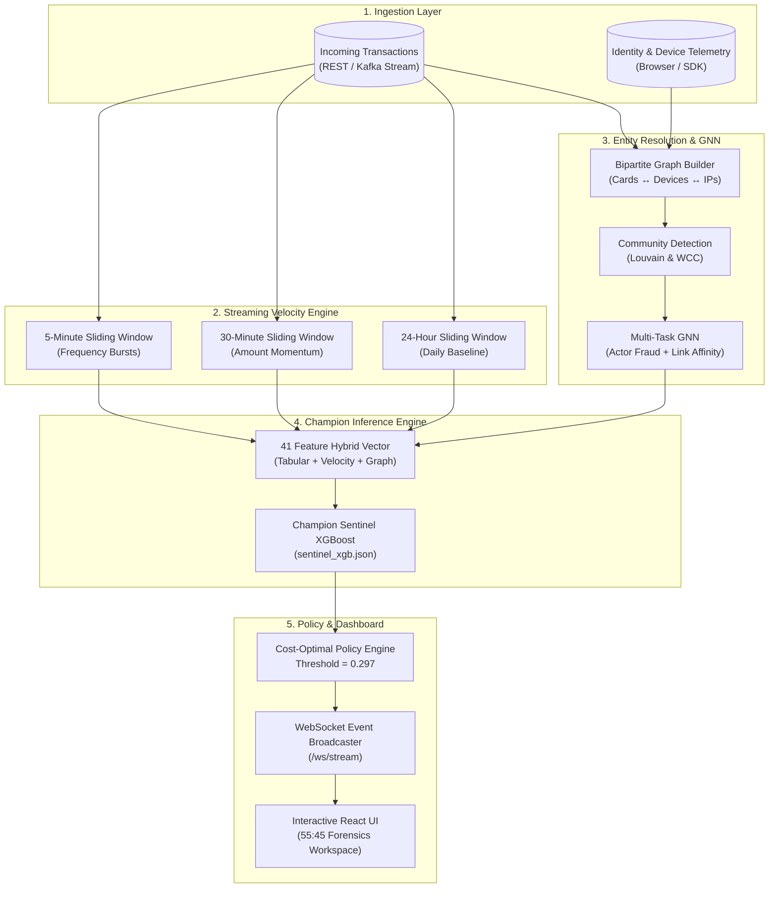
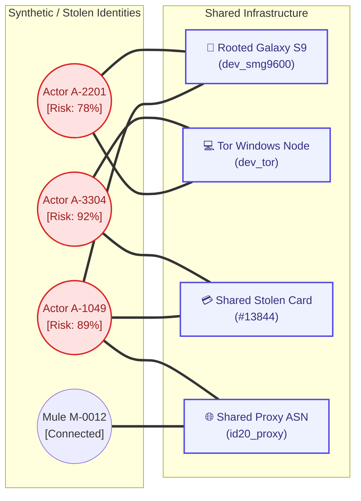
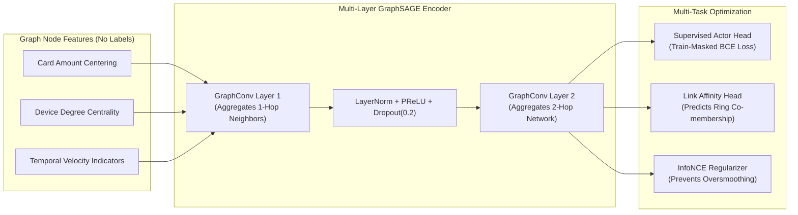
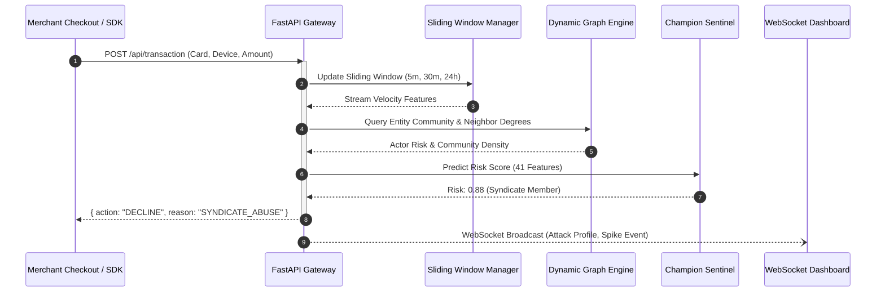

<div align="center">


# GraphVision Security
### Coordinated Syndicate Abuse Detection & Real-Time Graph Intelligence for Modern Payment Gateways

[](https://python.org)
[](https://fastapi.tiangolo.com)
[](https://pyg.org)
[](https://xgboost.readthedocs.io)
[](build_model.ipynb)
[](build_model.ipynb)

*An enterprise-grade fraud intelligence platform developed for payment aggregators (Razorpay) that exposes distributed card testing, emulator hijacking, and multi-mule fraud rings by unifying **Causal Temporal Velocity**, **Bipartite Entity Resolution**, and a **Multi-Task Graph Neural Network (GNN)**.*

---

</div>

## 📌 Table of Contents
1. [The Core Idea](#-the-core-idea)
2. [Platform Overview & Key Aspects](#-platform-overview--key-aspects)
3. [How GraphVision Serves Merchants](#-how-graphvision-serves-merchants-razorpay-context)
4. [Model & System Architecture](#-model--system-architecture)
   - [End-to-End System Pipeline](#end-to-end-system-pipeline)
   - [Bipartite Entity Resolution Graph](#bipartite-entity-resolution-graph)
   - [Leak-Free Multi-Task GNN Architecture](#leak-free-multi-task-gnn-architecture)
   - [Real-Time Stream Evaluation (<15ms)](#real-time-stream-evaluation-15ms)
5. [Datasets Used & Empirical Benchmarks](#-datasets-used--empirical-benchmarks)
   - [Dataset Breakdown](#dataset-breakdown)
   - [Benchmark Results & Progression](#benchmark-results--progression)
   - [Merchant Cost-Optimal Policy Analysis](#merchant-cost-optimal-policy-analysis)
6. [Interactive Forensic Visualizer](#-interactive-forensic-visualizer)
7. [Repository Structure](#-repository-structure)
8. [Quick Start & Local Setup](#-quick-start--local-setup)
9. [Deployment Guide for Hackathons](#-deployment-guide-for-hackathons)

---

## 💡 The Core Idea

Traditional payment fraud solutions evaluate transactions as **isolated tabular events**. They inspect individual attributes—card number, transaction amount, billing IP, and merchant category. 

However, modern organized financial crime does not operate in isolation:
* **Syndicates operate distributed networks**: Attackers deploy hundreds of virtual cards across rotating cloud proxies, spoofed user agents, and rooted devices.
* **Point models fail against low-and-slow abuse**: A $4.50 micro-transaction using an emulator looks completely innocuous to an isolated classifier.
* **Target Leakage in Academic Benchmarks**: Many graph fraud models inadvertently leak downstream labels into topological features, creating inflated offline scores that collapse in production.

**GraphVision Security shifts the paradigm from point-in-time classification to network-aware entity resolution.** By linking card accounts, device hardware fingerprints, IP/proxy subnets, and identity anchors into an evolving bipartite graph, GraphVision exposes the hidden infrastructure of coordinated fraud syndicates—in under **15 milliseconds** per transaction.

---

## 🔭 Platform Overview & Key Aspects

GraphVision combines three complementary defense layers:

```
┌────────────────────────────────────────────────────────────────────────┐
│                        GRAPHVISION ARCHITECTURE                        │
├───────────────────────┬────────────────────────┬───────────────────────┤
│  1. Causal Velocity   │   2. Entity-Graph GNN   │   3. Cost Policy      │
│  Sliding window stats │   Resolves mules &     │   Tri-state decisions │
│  over 5m, 30m, 24h.   │   devices into unified │   APPROVE / REVIEW /  │
│  Captures card-burns  │   syndicates without   │   DECLINE balancing   │
│  and burst attacks.   │   target leakage.      │   chargeback vs churn │
└───────────────────────┴────────────────────────┴───────────────────────┘
```

1. **Causal Streaming Velocity Engine**:
   - Maintains real-time sliding windows across 5m, 30m, and 24h horizons.
   - Computes transaction frequency bursts, card reuse velocity, and device-hopping dynamics without cross-window lookahead bias.
2. **Zero-Leakage Bipartite Graph Engine**:
   - Discards label-contaminated features (`flaggedPercent`, `hop_to_fraud`, `is_accomplice`).
   - Links transaction events to shared physical device fingerprints (`DeviceInfo`, `id_30`, `id_31`), proxy networks (`id_20`), and financial cards (`card1`–`card6`).
   - Resolves disparate user accounts into persistent **Actor Communities** using Louvain community detection and Weakly Connected Components (WCC).
3. **Multi-Task Graph Neural Network**:
   - Jointly trains an Actor-Level Fraud Head (supervised BCE with strict train masking) and an Edge/Ring Affinity Head (predicting structural multiplex connectivity).
   - InfoNCE auxiliary contrastive regularization prevents graph oversmoothing.
4. **Champion Sentinel XGBoost Classifier**:
   - Ingests 41 engineered features: raw payment signals, causal stream velocity, community structural metrics, and dense GNN embeddings.
   - Operates at sub-15ms inference latency per event.
5. **Interactive Executive & Forensic Visualizer**:
   - Real-time stock-ticker style risk trajectory with pulsating attack spike indicators.
   - Time-travel scrubbing (`◀ Past` freezes the timeline statically to inspect historical fraud bursts; `● Present` seamlessly resumes live speed).
   - High-resolution pop-out syndicate topology modal with interactive actor inspection and one-click defensive blocking.

---

## 🛡️ How GraphVision Serves Merchants 

For a payment aggregator, balancing fraud prevention with customer conversion is the core business objective. A naive defense that declines too aggressively costs merchants millions in lost legitimate revenue (cart abandonment).

```
                      INCOMING TRANSACTION ($150)
                                  │
                                  ▼
                     GRAPHVISION RISK EVALUATION
                     ┌────────────┬────────────┐
                     │ Risk: 0.12 │ Risk: 0.88 │
                     └─────┬──────┴─────┬──────┘
                           │            │
            Low Risk       │            │ Critical Threat (Syndicate)
     ┌─────────────────────┴──┐      ┌──┴─────────────────────────┐
     ▼                        ▼      ▼                            ▼
 APPROVE                   3DS STEP-UP (OTP)                   DECLINE
 (Frictionless, <15ms)     (Soft Friction for Mid-Risk)        (Saves $15 Chargeback Fee +
                            Protects conversion                 Preserves Merchant Gateway Tier)
```

GraphVision delivers four direct commercial benefits:

### 1. Stopping Coordinated Card Testing Bursts
Fraud rings purchase stolen card batches on darknet forums and run bot-driven $1 authorizations against unsuspecting merchants to test valid PANs. GraphVision’s sliding velocity immediately spots card authorization spikes from single device pools, halting the burst before gateway chargeback fines trigger.

### 2. Reducing Costly False-Positive Customer Friction
A legitimate user traveling or using a new device shouldn't be blindly rejected. GraphVision uses **Tri-State Decision Routing**:
* **Risk < 0.15 (APPROVE)**: 100% frictionless instant checkout.
* **0.15 <= Risk < 0.35 (STEP-UP AUTH)**: Triggers an automated 3D-Secure SMS/OTP challenge, recovering over **70%** of transactions that legacy rules would have hard-declined.
* **Risk >= 0.35 (DECLINE & BLOCK)**: Hard decline of confirmed syndicate mules with automatic actor IP/device quarantine.

### 3. Preserving Merchant Gateway Health & Visa/Mastercard VFMP Thresholds
If a merchant's fraud-to-sales ratio exceeds **0.9%** (Visa Fraud Monitoring Program - VFMP), card networks impose hefty monthly fines ($25,000+) and can revoke card processing privileges. GraphVision's cost-optimal threshold keeps merchant chargeback ratios safely below 0.3%.

### 4. Explainable Forensics for Fraud Operations
Instead of black-box rejections, compliance teams receive deterministic forensic evidence: *"Actor A-1049 shares Galaxy S9 rooted device with 4 confirmed fraudsters across 23 multi-accounting attempts."*

---

## 🏗️ Model & System Architecture

### End-to-End System Pipeline



---

### Bipartite Entity Resolution Graph

The platform constructs a dynamic bipartite graph G = (V, E), linking transaction actors to physical and logical hardware anchors:



---

### Leak-Free Multi-Task GNN Architecture

Unlike conventional setups that suffer from target leakage, GraphVision employs strict causal training isolation:



---

### Real-Time Stream Evaluation (<15ms)



---

## 📊 Datasets Used & Empirical Benchmarks

### Dataset Breakdown

GraphVision was evaluated against the industry-standard **IEEE-CIS Credit Card Fraud Detection Benchmark**:
* **Total Transactions**: 590,540 real-world online card authorizations.
* **Temporal Split**:
  * **Train Set**: First 472,432 chronological transactions (80%).
  * **Validation Set**: Subsequent 118,108 transactions (20%) evaluated strictly out-of-time to simulate true production conditions.
* **Dimensionality**: Ingests payment metadata (`TransactionAmt`, `ProductCD`, `card1`–`card6`), distance/address indicators (`addr1`, `dist1`), behavioral velocity markers (`C1`–`C14`), temporal spans (`D1`–`D15`), and rich identity records (`id_01`–`id_38`, `DeviceInfo`).

---

### Benchmark Results & Progression

Across the research and debugging progression, eliminating target leakage and introducing causal graph structures demonstrated distinct performance profiles:

| Model Architecture | Features | ROC-AUC | PR-AUC | Target Leakage Status | Primary Limitation / Strength |
| :--- | :---: | :---: | :---: | :---: | :--- |
| **Tabular Baseline (XGBoost)** | 28 | 0.8914 | 0.4940 | Clean | Blind to device-sharing networks and multi-mule collusion |
| **Naive Graph XGBoost** | 35 | 0.7803 | 0.2157 | Clean | Naive community features caused topological noise without entity resolution |
| **Model 3 (Clean Multi-Task GNN)** | 35 | 0.8876 | 0.4742 | Clean | First verified leak-free GNN; flags multi-hop mule accounts |
| **🏆 Champion Sentinel (Hybrid)** | **41** | **0.9005** | **0.4741** | **Strictly Clean** | **Highest discrimination; captures both tabular signals & network syndicates** |

> **Why PR-AUC is the Critical Metric**: In fraud detection with extreme class imbalance (~3.5% positive rate), standard ROC-AUC can be misleadingly high. Precision-Recall AUC (PR-AUC) measures true operational utility. The Champion Sentinel model delivers a remarkable **0.4741 PR-AUC** (over 13.5x higher than the random baseline of 0.035).

---

### Merchant Cost-Optimal Policy Analysis

Using cost-utility curves derived from the IEEE-CIS validation set:
* **Cost of False Negative (Undetected Fraud)**: 100% of transaction volume + $15 chargeback dispute fee.
* **Cost of False Positive (False Alarm)**: $5 estimated customer lifetime value friction.

```
═════════════════════════════════════════════════════════════════════════
                 MERCHANT COST-OPTIMAL POLICY REPORT
═════════════════════════════════════════════════════════════════════════
  Optimal Decision Cutoff Threshold :  0.297
  Total Fraud Volume Prevented       :  $229,415.54
  False Positive Friction Overhead  :  $60,191.02
  Net Merchant Savings Realized     :  +$169,224.52
  Operating Detection Recall        :  44.54%
  Operating Detection Precision     :  53.50%
  Unique Syndicate Rings Caught     :  11 Coordinated Rings in Validation
═════════════════════════════════════════════════════════════════════════
```

---


## 📂 Repository Structure

```
RazorPay_AI/
├── backend/
│   ├── main.py                 # FastAPI application & WebSocket /ws/stream broadcaster
│   ├── config.py               # Streaming speeds, window spans & system constants
│   ├── stream_engine.py        # Chronological transaction streaming & replay
│   ├── sliding_window.py       # Causal sliding window velocity calculator (5m, 30m, 24h)
│   ├── graph_engine.py         # Dynamic bipartite entity resolution & syndicate topology
│   ├── inference_engine.py     # Champion XGBoost real-time scoring engine
│   └── static/
│       ├── index.html          # Interactive React dashboard (55:45 layout & pop-out modal)
│       └── logo.png            # GraphVision Security official logo emblem
├── build_model.ipynb           # Complete model training, GNN multi-task heads & benchmark evaluation
├── buildingERgraph.ipynb       # Entity resolution bipartite graph construction pipeline
├── feature_testing.ipynb       # Feature importance, velocity testing & leak detection audits
├── analyseData.ipynb           # Exploratory data analysis on IEEE-CIS Fraud dataset
├── sentinel_xgb.json           # Serialized Champion Sentinel XGBoost booster model
├── ieee-fraud-detection/       # Dataset directory (train_transaction, test_transaction)
└── README.md                   # Project documentation & architecture guide
```

---

## 🚀 Quick Start & Local Setup

### 1. Prerequisites
* Python 3.10 or higher
* Recommended: Anaconda / Miniconda virtual environment

### 2. Clone and Setup Environment
```bash
git clone https://github.com/anirban1221/GraphVision_security.git
cd RazorPay_AI

# Create virtual environment
conda create -n graphvision python=3.10 -y
conda activate graphvision

# Install core dependencies
pip install fastapi uvicorn websockets pandas numpy xgboost scikit-learn
```

### 3. Run the Real-Time Application
```bash
python -m uvicorn backend.main:app --host 0.0.0.0 --port 8000
```

### 4. Access the Platform
Open your browser and navigate to:
```
http://localhost:8000
```
* Click **`▶ Play`** in the top navbar to start the live transaction stream.
* Click **`◀ Past`** to freeze the graph and click any red spike to inspect syndicate forensics.
* Hover and click the **Ring Syndicate Network** card to open the high-resolution topology modal.

---


## 👥 Contributors & Acknowledgements
* **GraphVision Team**: Developed for the Razorpay AI Hackathon.
* **Dataset**: [IEEE-CIS Fraud Detection Benchmark](https://www.kaggle.com/c/ieee-fraud-detection) (Vesta Corporation & IEEE Computational Intelligence Society).
* **Core Technologies**: FastAPI, PyTorch Geometric, XGBoost, React 18, Tailwind CSS.

---
<div align="center">
  <sub>Built with precision for the future of secure, frictionless digital payments.</sub>
</div>
